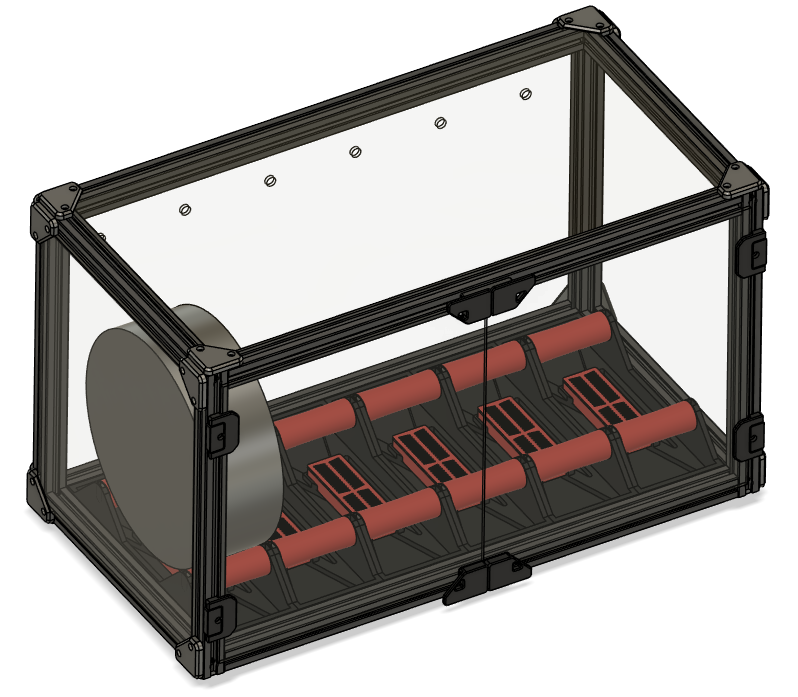

# Armadillo-DryBox
Drybox made for Voron 2.4 350  
 

# BOM
| Component | Qty | Source |
| :--- | :--- | :--- |
| Aluminium Profile 2020 L470 Thread on each end | 4 | [V-Slot](https://www.v-slot.pl/pl/p/Profil-aluminiowy-konstrukcyjny-V-Slot-2020-Na-wymiar-BLACK/906) |
| Aluminium Profile 2020 L230 Thread on each end | 4 | [V-Slot](https://www.v-slot.pl/pl/p/Profil-aluminiowy-konstrukcyjny-V-Slot-2020-Na-wymiar-BLACK/906) |
| Aluminium Profile 2020 L300 holes 10mm from eatch end | 4 | [V-Slot](https://www.v-slot.pl/pl/p/Profil-aluminiowy-konstrukcyjny-V-Slot-2020-Na-wymiar-BLACK/906) |
| Bottom ABS Panel 3mm 484x244 | 1 | [Fabertec](https://plyty.fabertec.pl/pl/p/Plyta-ABS-czarna-z-moletem/432)|
| Top Clear PMMA Panel 3mm 484x244 | 1 | [Fabertec](https://plyty.fabertec.pl/PMMA-plexi-bezbarwna)|
| Side Clear PMMA Panel 3mm 274x244 | 2 | [Fabertec](https://plyty.fabertec.pl/PMMA-plexi-bezbarwna)|
| Door Clear PMMA Panel 3mm 242x274 | 2 | [Fabertec](https://plyty.fabertec.pl/PMMA-plexi-bezbarwna)|
| Back Clear PMMA Panel 3mm  484x274 with holes ([DXF](DXF/Back_Panel_484x274.dxf)) | 1 | [Fabertec](https://plyty.fabertec.pl/PMMA-plexi-bezbarwna)|
| [Corner](STL/Corner.stl) | 20 | Printed |
| [Base](STL/Base.stl) | 6 | Printed |
| [\[a\]_Roller](STL/[a]_Roller.stl) | 12 | Printed with supports |
| [\[a\]_Spacer](STL/[a]_Spacer.stl) | 24 | Printed |
| [\[a\]_SilicaGel_Box](STL/[a]_SilicaGel_Box.stl) | 6 | Printed |
| [\[a\]_SilicaGel_Lid](STL/[a]_SilicaGel_Lid.stl) | 6 | Printed |
| [Stand](STL/Stand.stl) | x | Print as needed. Scale length. |
| Door Hinge | 4 | Printed from Voron Repo |
| Handle A | 2 | Printed from Voron Repo |
| Handle B | 2 | Printed from Voron Repo |
| Latch | 2 | Printed from Voron Repo |
| ECAS04 | 6 | [Aliexpress](https://pl.aliexpress.com/item/1005005622840354.html?spm=a2g0o.order_list.order_list_main.15.67e51c24oUo2OH&gatewayAdapt=glo2pol) |
| 8mm Stainless Steel Rod L75mm | 12 | |
| 608 Bearing | 24 | |
| 3x6mm Magnet | 6 | |
| M3x8 SHCS | 70 | |
| M3 T-nut | 70 | |
| M5x16 BHCS | 16 | |

#
